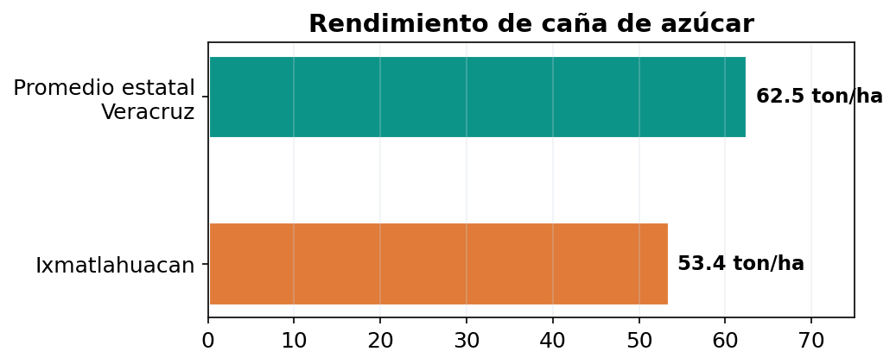
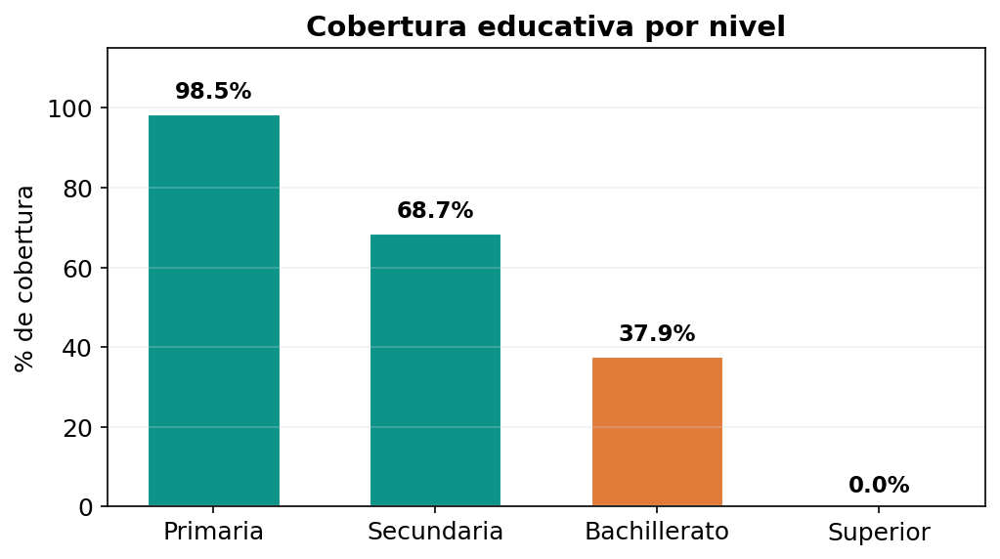
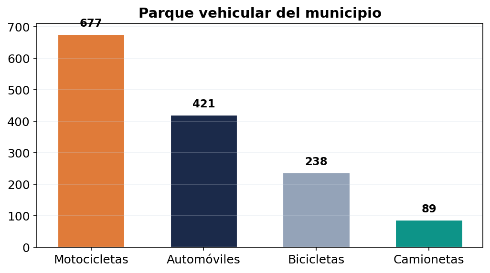
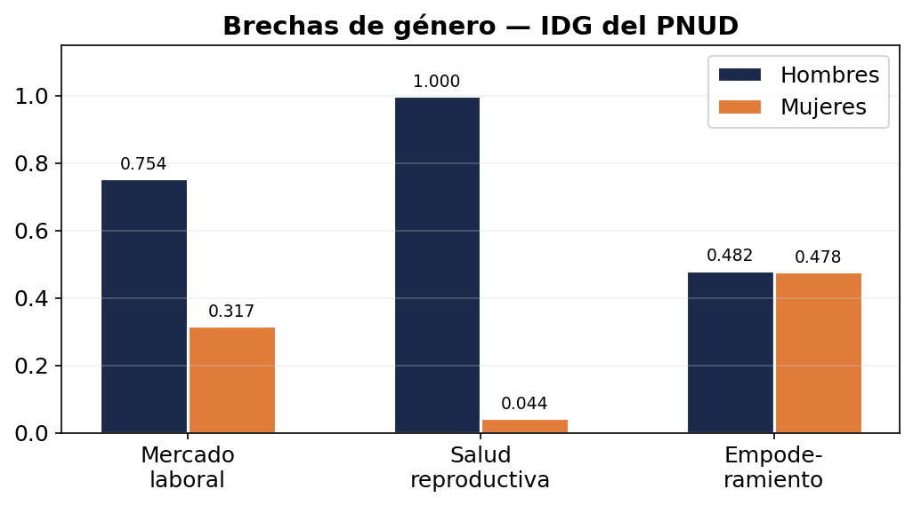
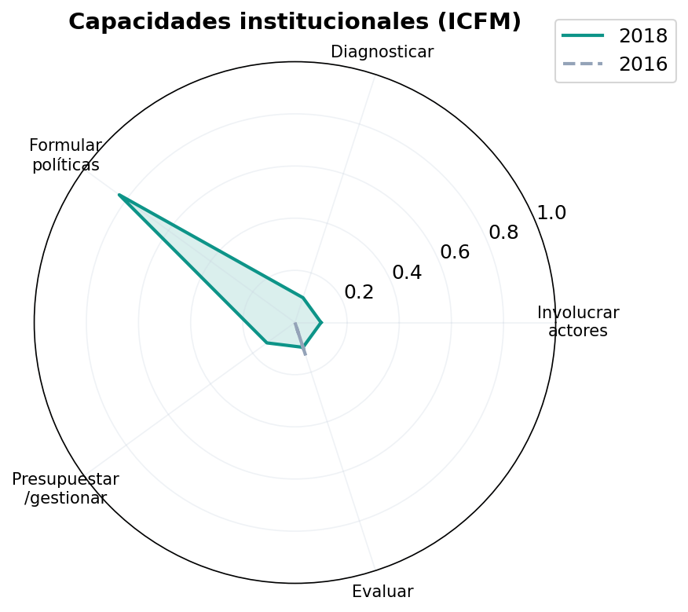
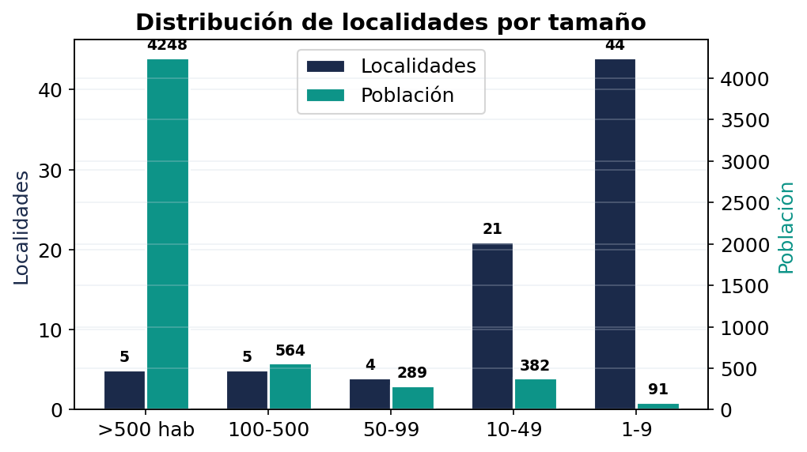

+++
title = "Santiago Ixmatlahuacan: diagnóstico municipal en datos"
date = "2026-05-08"
description = "Análisis socioeconómico de un municipio veracruzano de 5,574 habitantes a partir de los datos del PMD 2026-2029."
tags = ["política pública", "desarrollo regional", "finanzas públicas", "Veracruz", "municipios"]
showTableOfContents = true
+++

*Análisis socioeconómico de un municipio veracruzano de 5,574 habitantes, 79 localidades y un presupuesto de $46.8 millones de pesos en la cuenca baja del Papaloapan.*

**Datos del PMD 2026-2029 — Santiago Ixmatlahuacan, Veracruz**

---

Santiago Ixmatlahuacan es uno de esos municipios que pocas veces aparecen en las noticias. No tiene hospital, no tiene bachillerato con cobertura plena, no tiene servicio de recolección de basura. Pero sí tiene 5,574 personas que viven, trabajan y esperan algo de su gobierno. Esto es lo que encontramos al construir su Plan Municipal de Desarrollo.

| | | | |
|:---:|:---:|:---:|:---:|
| **5,574** | **79** | **$46.8M** | **347 km²** |
| Habitantes | Localidades | Presupuesto | Superficie |

---

## Un municipio que depende de una sola planta

La caña de azúcar representa el **95% del valor de la producción agrícola** del municipio. Todo lo demás — maíz, frijol, pastos — es marginal. El problema no es solo la concentración sino el rendimiento: Ixmatlahuacan produce **53.4 toneladas por hectárea**, cuando el promedio estatal es de 62.5. Produce menos y depende más.

<svg viewBox="0 0 680 280" xmlns="http://www.w3.org/2000/svg" style="max-width:100%;height:auto;font-family:system-ui,-apple-system,Segoe UI,Roboto,sans-serif;background:#ffffff;border-radius:8px;padding:8px;"><text x="20" y="26" class="ag-title">Composición del valor agrícola — Ixmatlahuacan</text><text x="20" y="42" class="ag-sub">% del valor de producción · SIAP, Anuario Estadístico 2024</text><g transform="translate(160,62)"><rect x="0" y="0" width="456" height="26" fill="#0d9488"/><text x="-8" y="18" text-anchor="end" class="ag-lbl">Caña de azúcar</text><text x="464" y="18" class="ag-val">95.0%</text><rect x="0" y="36" width="10.1" height="26" fill="#475569"/><text x="-8" y="54" text-anchor="end" class="ag-lbl">Maíz grano</text><text x="18" y="54" class="ag-val">2.1%</text><rect x="0" y="72" width="6.2" height="26" fill="#94a3b8"/><text x="-8" y="90" text-anchor="end" class="ag-lbl">Pastos</text><text x="14" y="90" class="ag-val">1.3%</text><rect x="0" y="108" width="4.3" height="26" fill="#cbd5e1"/><text x="-8" y="126" text-anchor="end" class="ag-lbl">Frijol</text><text x="12" y="126" class="ag-val">0.9%</text><rect x="0" y="144" width="3.4" height="26" fill="#e2e8f0"/><text x="-8" y="162" text-anchor="end" class="ag-lbl">Otros cultivos</text><text x="11" y="162" class="ag-val">0.7%</text></g><text x="20" y="268" class="ag-src">Fuente: SIAP, Anuario Estadístico de la Producción Agrícola 2024.</text></svg>

*14.5% por debajo del promedio estatal de Veracruz. Fuente: SIAP, Anuario Estadístico 2024.*

> Cuando el precio de la caña cae, no hay plan B. No hay industria alternativa, no hay turismo, no hay educación superior. La gente migra o espera.

---

## La brecha educativa que se abre con cada nivel

La cobertura educativa en Ixmatlahuacan se desploma conforme avanza el nivel escolar. La primaria tiene una cobertura casi universal (**98.53%**), pero en secundaria baja a **68.68%** y en bachillerato a apenas **37.87%**. Educación superior: **0%**. No existe ninguna institución de educación superior en el municipio.

Los estudiantes que quieren cursar bachillerato deben trasladarse a Cosamaloapan o Carlos A. Carrillo. El costo del transporte: **$60 pesos diarios**, una cifra prohibitiva cuando el 89.4% de la población ocupada gana menos de 2 salarios mínimos.

---

## 677 motocicletas y cero señalamientos viales

El medio de transporte dominante en Ixmatlahuacan no es el automóvil sino la **motocicleta**: 677 motos contra 421 automóviles. En un municipio con caminos rurales deteriorados, sin señalamientos viales y sin cultura de seguridad vial, esto representa un problema de salud pública silencioso.

*Las motocicletas representan el 62% del parque vehicular motorizado. Fuente: Cuadernillo Municipal SEFIPLAN 2024.*

---

## La desigualdad de género en tres números

El Índice de Desigualdad de Género del PNUD para Ixmatlahuacan cuenta una historia en tres dimensiones:

| Dimensión | Hombres | Mujeres | Brecha |
|:---|:---:|:---:|:---|
| Mercado laboral | 0.754 | 0.317 | La participación económica femenina es menos de la mitad |
| Salud reproductiva | 1.000 | 0.044 | Brecha abismal en salud materna |
| Empoderamiento | 0.482 | 0.478 | Relativamente equilibrado |

Las mujeres participan políticamente casi al mismo nivel que los hombres. Pero esa participación no se traduce en igualdad económica: su participación en el mercado laboral es **menos de la mitad** que la de los hombres. Y en salud reproductiva, la brecha es abismal: **0.044** contra 1.000.

---

## 80% quema su basura

No existe servicio de recolección de residuos sólidos en Ixmatlahuacan. Ni en la cabecera ni en las localidades. El Cuadernillo Municipal reporta **NA** (no aplica) en promedio diario de residuos recolectados. La consecuencia: se estima que el **80% de las viviendas quema su basura**. El basurero municipal fue invadido por la mancha urbana y las tres personas entrevistadas en la consulta ciudadana lo identificaron como problema urgente.

Solo el **50% del alumbrado público funciona**. La planta de tratamiento de aguas residuales dejó de operar en 2022. El dato más revelador del estado de los servicios públicos es quizá este: el municipio tiene **0 de 3** componentes de un sistema básico de limpia pública (vehículo recolector, cronograma de rutas, sitio de disposición final).

---

## Capacidades institucionales: el ICFM

El Índice de Capacidades Funcionales Municipales (ICFM) del PNUD mide 5 competencias institucionales. El resultado para Ixmatlahuacan muestra áreas de oportunidad importantes:

*Fuente: PNUD, Informe de Desarrollo Humano Municipal 2010-2020.*

> La formulación de políticas alcanza 0.833, mientras que ejecución (0.133), evaluación (0.100), participación ciudadana (0.100) y diagnóstico (0.100) representan las áreas de mayor oportunidad de mejora.

---

## Las 6 cooperativas que no existen en los datos

Uno de los hallazgos más relevantes de la consulta ciudadana: existen **6 cooperativas pesqueras** con aproximadamente 120 miembros activos que operan en los cuerpos de agua del municipio (río Camarón, laguna María Lizardo, laguna de Chalpa). Pescan tilapia, robalo y camarón de río.

Sin embargo, estas cooperativas **no aparecen en ninguna fuente oficial**. El SIAP no registra producción pesquera para Ixmatlahuacan. El Censo Económico no las captura. El Cuadernillo Municipal no las menciona. Para las estadísticas nacionales, la pesca en Ixmatlahuacan simplemente no existe. Esto representa un sector productivo con potencial que opera al margen de cualquier política pública.

---

## ¿Cuánto presupuesto recibe cada habitante?

| Concepto | Ixmatlahuacan | Cosamaloapan | Tierra Blanca |
|:---|---:|---:|---:|
| Población | 5,574 | 57,636 | 52,265 |
| Presupuesto total | $46.8 mdp | $210.5 mdp | $290.0 mdp |
| **Per cápita** | **$8,396** | **$3,652** | **$5,550** |
| FAISMUN per cápita | $2,021 | $494 | $693 |
| Localidades | 79 | 78 | 197 |

Ixmatlahuacan recibe más presupuesto per cápita que municipios diez veces más grandes. La fórmula del FAISMUN pondera la pobreza y el rezago social, lo que beneficia proporcionalmente a los municipios más pequeños y marginados. El reto está en la capacidad de ejecución y en la atención a la dispersión territorial.

---

## El reto de la dispersión territorial

El 67.7% de la población vive fuera de la cabecera, disperso en 78 localidades rurales. De esas 78, solo 5 tienen más de 100 habitantes. Las otras 73 son rancherías de entre 1 y 99 personas. En 44 localidades, CONAPO ni siquiera puede calcular un índice de marginación porque son demasiado pequeñas.

Este es el desafío fundamental: ¿cómo gobiernas 79 localidades con 145 empleados municipales y $46.8 millones de pesos? ¿Cómo llevas agua, drenaje, alumbrado y caminos a rancherías de 3 personas? Los agentes y subagentes municipales — esas figuras a las que casi nadie presta atención — son la respuesta institucional a esa pregunta.

---

*Datos: INEGI Censo 2020 · CONEVAL 2020 · PNUD IDH Municipal 2020 · SIAP 2024 · CONAPO 2020 · Cuadernillo Municipal SEFIPLAN 2024 · Consulta ciudadana PMD 2026-2029.*
